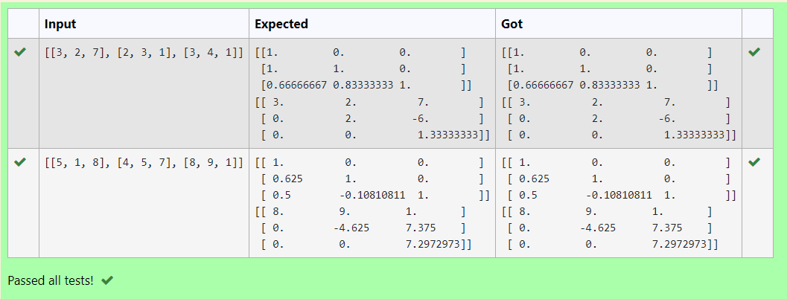
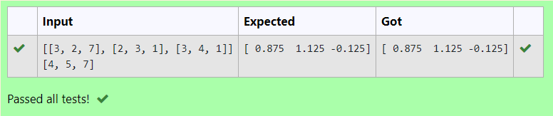

# LU Decomposition 

## AIM:
To write a program to find the LU Decomposition of a matrix.

## Equipments Required:
1. Hardware – PCs
2. Anaconda – Python 3.7 Installation / Moodle-Code Runner

## Algorithm
1. To Find L and U matrices with LU Decomposition

Step 1:
Get the matrix from the user.

Step 2:
Using "from scipy.linalg import lu" to import scipy (LU) module.

Step 3:
Using "L,U=lu(a)" we can get the matrix of L and U.

Step 4:
Print the result matrices (L and U Matrices).

Step 5:
End of the Program.

2. To Find X matrix with LU Decomposition

Step 1:
Get the matrix from the user.

Step 2:
Using "from scipy.linalg import lu_factor,lu_solve" to import scipy module for factorization and solving X.

Step 3:
Using "lu,piv=lu_factor(a)"

Step 4:
Print the output(x matrix)

Step 5:
End of the Program.

## Program:
(i) To find the L and U matrix
```
/*
Program to find the L and U matrix.
Developed by: Leann
RegisterNumber: 22004468
import numpy as np
from scipy.linalg import lu
arr=eval(input())
A=np.array(arr)
P,L,U=lu(A)
print(L)
print(U)
*/
```

(ii) To find the LU Decomposition of a matrix
```
/*
Program to find the LU Decomposition of a matrix.
Developed by: Leann
RegisterNumber: 22004468
import numpy as np
from scipy.linalg import lu_factor,lu_solve
A=np.array(eval(input()))
B=eval(input())
res=lu_factor(A)
solution=lu_solve(res,B)
print(solution)
*/
```

## Output:




## Result:
Thus the program to find the LU Decomposition of a matrix is written and verified using python programming.

